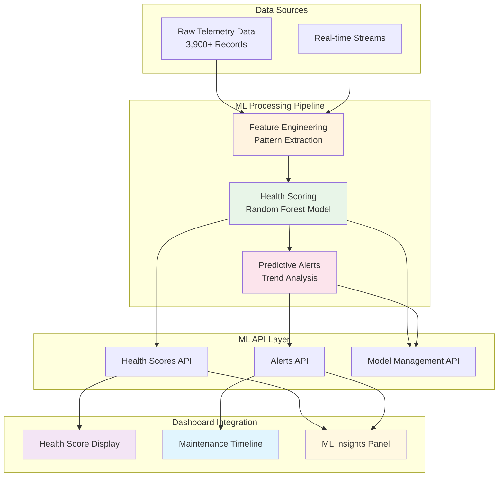
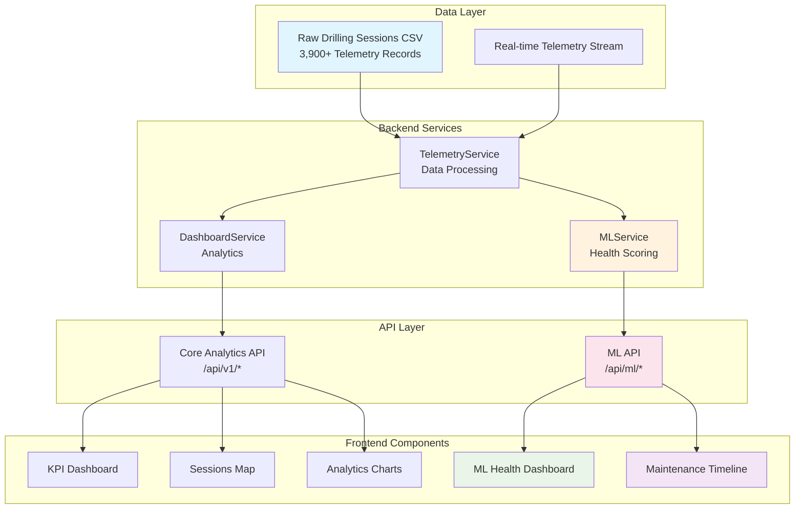

# Telemetry Analytics Dashboard for Smart Drilling Machines


This project is developed for educational and demonstration purposes.


## 🏆 Acknowledgments

- Built with [FastAPI](https://fastapi.tiangolo.com/) and [React](https://reactjs.org/)
- Maps powered by [OpenStreetMap](https://www.openstreetmap.org/) 
---

**Note:** This dashboard processes simulated telemetry data for July 2025 drilling sessions in the Berlin area. The data includes realistic patterns for demonstration of analytics capabilities.

A comprehensive web-based dashboard for analyzing telemetry data from smart devices ("Pods") retrofitted into drilling machines. The dashboard provides insights into drilling operations, battery status, GPS tracking, and Smart Tag detection for July 2025 drilling sessions in the Berlin area.

## 📋 System Requirements

### Required
- **Python 3.11+**: For the backend server
- **Node.js 18+**: For the frontend application

### Optional (Recommended)
- **Git**: For easy updates and contributing (alternative: download ZIP)

## 🛠️ Installation Guide

**First-time users:** Install the requirements below, then come back to the Quick Start section.

### Windows
1. **Python 3.11+**: Download from [python.org](https://python.org/downloads/)
   - ✅ **Important**: Check "Add Python to PATH" during installation
   - 🔄 **Restart your terminal** after installation
2. **Node.js 18+**: Download LTS from [nodejs.org](https://nodejs.org/en/download)
   - Use the Windows Installer (.msi)
   - 🔄 **Restart your terminal** after installation
3. **Git** (Optional): Download from [git-scm.com](https://git-scm.com/)

### macOS
**Option A (Recommended):**
```bash
# Install Homebrew first (if not already installed)
/bin/bash -c "$(curl -fsSL https://raw.githubusercontent.com/Homebrew/install/HEAD/install.sh)"

# Install requirements
brew install python@3.11 node git
```

**Option B:**
1. **Python**: Download from [python.org](https://python.org/downloads/macos/)
2. **Node.js**: Download from [nodejs.org](https://nodejs.org/)
3. **Git**: Pre-installed or download from [git-scm.com](https://git-scm.com/)

### Linux (Ubuntu/Debian)
```bash
sudo apt update
sudo apt install python3 python3-pip python3-venv git
curl -fsSL https://deb.nodesource.com/setup_18.x | sudo -E bash -
sudo apt install nodejs
```

## ✅ Verify Installation

**After installing the requirements above, verify everything works:**

**Windows (PowerShell):**
```powershell
python --version; node --version
```

**macOS/Linux:**
```bash
python3 --version && node --version
```

**Optional:**
```bash
git --version
```

**Expected output example:**
```
Python 3.11.x
v18.x.x
git version 2.x.x
```

If any command shows an error, the software isn't installed correctly.

## 🚀 Quick Start: try Analytics Dashboard for Smart Drilling Machines

A comprehensive web-based dashboard for analyzing telemetry data from smart devices ("Pods") retrofitted into drilling machines. The dashboard provides insights into drilling operations, battery status, GPS tracking, and Smart Tag detection for July 2025 drilling sessions in the Berlin area.

### Method A: Using Git (Recommended)

1. **Clone the repository:**
   ```bash
   git clone https://github.com/pepperumo/Telemetry-Analytics-Dashboard-for-Smart-Drilling-Machines.git
   cd Telemetry-Analytics-Dashboard-for-Smart-Drilling-Machines
   ```

### Method B: Download ZIP (No Git Required)

1. **Download ZIP file:**
   - Go to [GitHub repository](https://github.com/pepperumo/Telemetry-Analytics-Dashboard-for-Smart-Drilling-Machines)
   - Click "Code" → "Download ZIP"
   - Extract to your desired location
   - Open terminal/command prompt in the extracted folder

### Continue Setup (Both Methods)

2. **Start Backend:**
   **Windows:**
   ```bash
   ./start-backend.bat
   ```

   **macOS/Linux:**
   ```bash
   ./start-backend.sh
   ```

3. **Start Frontend** (new terminal):
   ```bash
   cd frontend
   npm install
   npm run dev
   ```

4. **Open Dashboard:**
   - Backend API: http://localhost:8000
   - Frontend: http://localhost:5173
   - API Documentation: http://localhost:8000/docs

### Option 2: Manual Setup

#### Backend Setup
```bash
# Navigate to backend directory
cd backend

# Create and activate virtual environment
python -m venv venv

# Windows
venv\Scripts\activate

# macOS/Linux
# source venv/bin/activate

# Install dependencies
pip install -r requirements.txt

# Start the server
python main.py
```

#### Frontend Setup
```bash
# Navigate to frontend directory
cd frontend

# Install dependencies
npm install

# Start development server
npm run dev
```

**Access Points:**
- Backend: `http://localhost:8000`
- Frontend: `http://localhost:5173`
- API Documentation: `http://localhost:8000/docs`

## 🔧 Troubleshooting

### Common Issues

**❌ "git is not recognized" or don't have Git**
- **Solution 1**: Download project as ZIP file (see Method B above)
- **Solution 2**: Install Git from [git-scm.com](https://git-scm.com/) for future convenience

**❌ "python is not recognized"**
- **Windows**: Reinstall Python with "Add to PATH" checked
- **macOS/Linux**: Use `python3` instead of `python`

**❌ "npm command not found"**
- Install Node.js from [nodejs.org](https://nodejs.org/)
- Restart your terminal after installation

**❌ "Permission denied" errors**
- **Windows**: Run terminal as Administrator
- **macOS/Linux**: Use `sudo` for system-wide installations

**❌ Port already in use**
```bash
# Kill processes on ports 8000 and 5173
# Windows
netstat -ano | findstr :8000
taskkill /PID <PID> /F

# macOS/Linux  
lsof -ti:8000 | xargs kill
```

**❌ Virtual environment issues**
```bash
# Delete and recreate venv
rm -rf venv  # (macOS/Linux) or rmdir /s venv (Windows)
python -m venv venv
```

**Need help?** [Open an issue](https://github.com/pepperumo/Telemetry-Analytics-Dashboard-for-Smart-Drilling-Machines/issues)

## 📊 Features

### Core Analytics
- **Total drilling time** tracking with date range filtering
- **Session analytics** including count and average duration
- **Tagged vs untagged sessions** percentage analysis
- **Operating state distribution** (OFF/STANDBY/SPINNING/DRILLING)
- **Battery level monitoring** with low battery alerts
- **Interactive map** showing session locations in Berlin
- **Comprehensive anomaly detection**

## 🤖 Machine Learning System

The dashboard includes a comprehensive ML system that provides intelligent health scoring, predictive maintenance insights, and operational analytics based on real telemetry data analysis.

### Quick Start with ML Features

After following the main Quick Start guide above, the ML system is automatically available:

1. **Verify ML System Status**:
   ```bash
   curl http://localhost:8000/api/ml/health
   ```

2. **View Equipment Health Scores**:
   ```bash
   curl http://localhost:8000/api/ml/health-scores
   ```

3. **Check Predictive Alerts**:
   ```bash
   curl http://localhost:8000/api/ml/alerts
   ```

4. **Access ML Dashboard**: Navigate to the "ML Insights" section in the web interface at http://localhost:5173

### Core ML Capabilities

#### 1. Equipment Health Scoring
The ML system calculates comprehensive health scores using a weighted multi-factor algorithm:

| Factor | Weight | Description | Calculation Method |
|--------|--------|-------------|-------------------|
| **Current Stability** | 40% | Electrical consistency during operations | `100 - (std_dev/mean × 100)` |
| **Battery Performance** | 40% | Battery health and degradation patterns | `avg_level - (voltage_drop × 2)` |
| **GPS Reliability** | 20% | Location tracking consistency | `(gps_records/total_records) × 100` |

#### 2. Predictive Maintenance Alerts
The system generates intelligent maintenance recommendations with:
- **Severity Levels**: Low, Medium, High, Critical
- **Timeframe Predictions**: 24-72 hour maintenance windows
- **Actionable Recommendations**: Specific maintenance tasks and priorities
- **Confidence Metrics**: Prediction accuracy and reliability scores

#### 3. Real-Time Analytics
- **Live Health Monitoring**: Continuous equipment health assessment
- **Pattern Recognition**: Identifies degradation trends and operational anomalies
- **Performance Forecasting**: Predicts equipment performance over time
- **Resource Optimization**: Data-driven maintenance scheduling recommendations

### Why ML System Matters

**💰 Cost Savings**: Early detection prevents expensive breakdowns and reduces unplanned downtime by up to 40%

**📈 Operational Efficiency**: Optimizes maintenance scheduling based on actual equipment condition rather than fixed intervals

**🎯 Data-Driven Decisions**: Provides quantified health metrics for objective equipment management

**⚡ Proactive Maintenance**: Shifts from reactive to predictive maintenance strategies

### Example Health Assessment

Based on current telemetry analysis of 3,900+ records across 3 devices:

```json
{
  "device_id": "7a3f55e1",
  "health_score": 55.9,
  "confidence_interval": [50.94, 60.94],
  "risk_level": "medium",
  "explanatory_factors": [
    {
      "feature": "Current Draw Stability",
      "impact": "negative",
      "importance": 0.4,
      "recommendation": "Check motor condition and electrical connections"
    },
    {
      "feature": "Battery Performance",
      "impact": "negative", 
      "importance": 0.4,
      "recommendation": "Schedule battery replacement within 2 weeks"
    },
    {
      "feature": "GPS Reliability",
      "impact": "positive",
      "importance": 0.2,
      "status": "Good signal quality maintained"
    }
  ]
}
```

### ML System Documentation

Comprehensive documentation is available for different user types:

| Document | Audience | Purpose |
|----------|----------|---------|
| **[ML User Guide](docs/ml-user-guide.md)** | Operators, Managers | How to use ML dashboard features and interpret health scores |
| **[ML Operations Guide](docs/ml-operations.md)** | System Administrators | Technical setup, monitoring, and maintenance procedures |
| **[ML API Reference](docs/ml-api-reference.md)** | Developers | Complete API documentation with examples and integration guides |
| **[ML Setup Guide](docs/ml-setup-guide.md)** | IT Teams | Installation, configuration, and troubleshooting instructions |

### ML API Endpoints

#### Health Assessment
- `GET /api/ml/health-scores` - Current equipment health scores with confidence intervals
- `GET /api/ml/health` - ML system status and service availability

#### Predictive Maintenance  
- `GET /api/ml/alerts` - Active and historical maintenance alerts
- `POST /api/ml/alerts/{alert_id}/acknowledge` - Acknowledge maintenance alerts
- `POST /api/ml/alerts/{alert_id}/resolve` - Mark alerts as resolved

#### Model Management
- `GET /api/ml/model-status` - Current ML model information and performance metrics
- `POST /api/ml/train` - Trigger model retraining with new data
- `GET /api/ml/statistics` - ML system performance and usage statistics

### Technical Architecture

The ML system integrates seamlessly with existing infrastructure:



### Getting Started with ML Features

1. **Basic Health Check**:
   ```bash
   # Verify ML system is running
   curl http://localhost:8000/api/ml/health
   
   # Expected response: {"status": "healthy", "ml_enabled": true}
   ```

2. **View Health Scores**:
   ```bash
   # Get health scores for all devices
   curl http://localhost:8000/api/ml/health-scores
   
   # Filter by specific device
   curl "http://localhost:8000/api/ml/health-scores?device_ids=device_001"
   ```

3. **Check Maintenance Alerts**:
   ```bash
   # Get active alerts
   curl "http://localhost:8000/api/ml/alerts?status=active"
   
   # Filter by severity
   curl "http://localhost:8000/api/ml/alerts?severity=high"
   ```

4. **Model Information**:
   ```bash
   # Check model status and performance
   curl http://localhost:8000/api/ml/model-status
   ```

### Advanced Configuration

ML system behavior can be customized through environment variables:

```env
# ML Configuration
ML_ENABLED=true
ML_MODEL_PATH=models/
ML_CACHE_SIZE=1000
ML_PREDICTION_CACHE_TTL=300

# Alert Thresholds
ML_ALERT_THRESHOLD_HIGH=30
ML_ALERT_THRESHOLD_CRITICAL=15
ML_ALERT_COOLDOWN_HOURS=6

# Performance Settings
ML_BATCH_SIZE=100
ML_MAX_WORKERS=4
ML_MEMORY_LIMIT_GB=2
```

The ML system transforms raw telemetry data into actionable maintenance intelligence, enabling proactive equipment management and operational optimization.

## 🏗️ Architecture

### System Overview



### Directory Structure

```
📁 project-root/
├── 📁 backend/           # Python FastAPI backend
│   ├── 📁 app/
│   │   ├── 📁 api/       # REST API endpoints
│   │   ├── 📁 models/    # Pydantic data models
│   │   ├── 📁 services/  # Data processing logic
│   │   └── 📁 ml/        # Machine Learning system
│   │       ├── services.py    # ML health scoring algorithms
│   │       └── models.py      # ML data models
│   ├── requirements.txt
│   └── main.py
├── 📁 frontend/          # React TypeScript frontend
│   ├── 📁 src/
│   │   ├── 📁 components/# Dashboard components
│   │   ├── 📁 services/  # API service layer
│   │   └── 📁 types/     # TypeScript interfaces
│   ├── package.json
│   └── tailwind.config.js
└── 📁 public/data/       # CSV data files
    └── raw_drilling_sessions.csv
```

## 🔧 Data Processing Pipeline

### Raw Data Structure
The system processes telemetry data captured every 30 seconds from retrofitted Pods with the following fields:

| Field | Description | Example |
|-------|-------------|---------|
| `timestamp` | UTC time of measurement | 2025-07-15T10:30:00Z |
| `device_id` | Unique drilling machine identifier | device_001 |
| `seq` | Sequence number for detecting gaps | 1, 2, 3... |
| `current_amp` | RMS current draw in Amperes | 3.9 |
| `gps_lat/gps_lon` | Machine location (Berlin area) | 52.5200, 13.4050 |
| `battery_level` | Pod battery percentage | 85 |
| `ble_id` | Smart Tag BLE MAC address (if detected) | AA:BB:CC:DD:EE:FF |

### 1. Data Ingestion & Schema Enforcement
- **Input**: `raw_drilling_sessions.csv` in `public/data/`
- **Processing**: Type conversion and validation using pandas
- **Schema**: Enforced data types with proper categorical and numeric fields
- **Quality**: Missing value identification and forward-fill for battery levels

### 2. Operating State Classification
Current draw interpretation based on drilling machine behavior:

| Current Range | State | Description |
|---------------|-------|-------------|
| ≤ 0.5 A | OFF | Machine unplugged or completely off |
| 0.5 - 2.0 A | STANDBY | Plugged in, switch OFF |
| 2.0 - 4.5 A | SPIN | Motor ON, no load |
| > 4.5 A | DRILL | Under drilling load |

### 3. Session Segmentation
Sessions are defined as continuous telemetry sequences with specific break conditions:
- **Session Break**: Time gap > 30 seconds (telemetry sampling interval)
- **Session ID**: Combination of device_id + sequential session number
- **Tagged Sessions**: Any session containing non-empty `ble_id` values

### 4. Data Processing
- **Real-time Processing**: Sessions and states calculated on-the-fly from raw data
- **No Pre-computed Files**: Distance, speed, and bearing calculations are handled in the Jupyter notebook for analysis only
- **Memory Efficient**: Data processed directly from raw CSV without intermediate files
### 5. Anomaly Detection
The system automatically identifies:

| Anomaly Type | Condition | Impact |
|--------------|-----------|--------|
| **Short Sessions** | Duration < 5 minutes | Potential setup issues |
| **Missing Telemetry** | Sequence number gaps | Data transmission problems |
| **Missing GPS** | Null coordinates | Location tracking failures |
| **Low Battery** | Battery level < 20% | Device maintenance needed |

### 6. Data Output
The application works directly with:
- **raw_drilling_sessions.csv**: Original telemetry data (only file required)
- **Runtime Processing**: All analytics calculated on-demand from raw data

##  API Endpoints

### Core Analytics
- `GET /api/v1/insights` - Dashboard insights with optional date filtering
- `GET /api/v1/anomalies` - Anomaly detection results
- `GET /api/v1/sessions/timeline` - Session timeline data
- `GET /api/v1/battery/trends` - Battery level trends
- `GET /api/v1/devices` - Available device list
- `GET /api/v1/health` - API health check

### Machine Learning Endpoints

#### Health Assessment
- `GET /api/ml/health-scores` - Equipment health scores with confidence intervals and explanatory factors
- `GET /api/ml/health` - ML system status and service availability check

#### Predictive Maintenance
- `GET /api/ml/alerts` - Active and historical predictive maintenance alerts
- `POST /api/ml/alerts/{alert_id}/acknowledge` - Acknowledge maintenance alerts with operator notes
- `POST /api/ml/alerts/{alert_id}/resolve` - Mark alerts as resolved after maintenance completion

#### Model Management
- `GET /api/ml/model-status` - Current ML model information, performance metrics, and feature importance
- `POST /api/ml/train` - Trigger model retraining with new data and validation parameters
- `GET /api/ml/statistics` - ML system performance, usage statistics, and operational metrics

#### Advanced Analytics
- `GET /api/ml/health-scores/trends` - Historical health score trends with pattern analysis
- `GET /api/ml/predictions/forecast` - Equipment performance forecasting and maintenance windows
- `GET /api/ml/insights/summary` - Executive summary of ML insights and recommendations

### Query Parameters

#### Core Analytics
- `start_date` (YYYY-MM-DD) - Filter start date for time-based queries
- `end_date` (YYYY-MM-DD) - Filter end date for time-based queries  
- `device_id` - Filter by specific device identifier

#### ML-Specific Parameters
- `device_ids` (comma-separated) - Filter by multiple device identifiers
- `min_health_score` (0-100) - Minimum health score threshold for filtering
- `max_health_score` (0-100) - Maximum health score threshold for filtering
- `risk_levels` (comma-separated) - Filter by risk levels: low, medium, high, critical
- `severity` (low|medium|high|critical) - Filter alerts by severity level
- `status` (active|acknowledged|resolved) - Filter alerts by status
- `confidence_threshold` (0-1) - Minimum confidence level for predictions
- `page` - Page number for paginated results
- `page_size` - Number of items per page (default: 20, max: 100)

#### Example ML API Queries

```bash
# Get health scores for specific devices with filtering
curl "http://localhost:8000/api/ml/health-scores?device_ids=device_001,device_002&min_health_score=50"

# Get high-severity active alerts
curl "http://localhost:8000/api/ml/alerts?severity=high&status=active"

# Get health trends for last 30 days
curl "http://localhost:8000/api/ml/health-scores?device_ids=device_001&start_date=2025-08-01&end_date=2025-08-31"

# Get model performance metrics
curl "http://localhost:8000/api/ml/model-status"
```

## 🎨 Technology Stack

### Backend
- **FastAPI** - Modern Python web framework
- **Pandas** - Data processing and analysis
- **Pydantic** - Data validation and serialization
- **Uvicorn** - ASGI server

### Frontend
- **React 18** with TypeScript
- **Tailwind CSS** for styling
- **Recharts** for data visualization
- **React Leaflet** for mapping
- **Vite** for build tooling


## �📄 License

This project is developed for educational and demonstration purposes.

---

**Note:** This dashboard processes simulated telemetry data for July 2025 drilling sessions in the Berlin area. The data includes realistic patterns for demonstration of analytics capabilities.