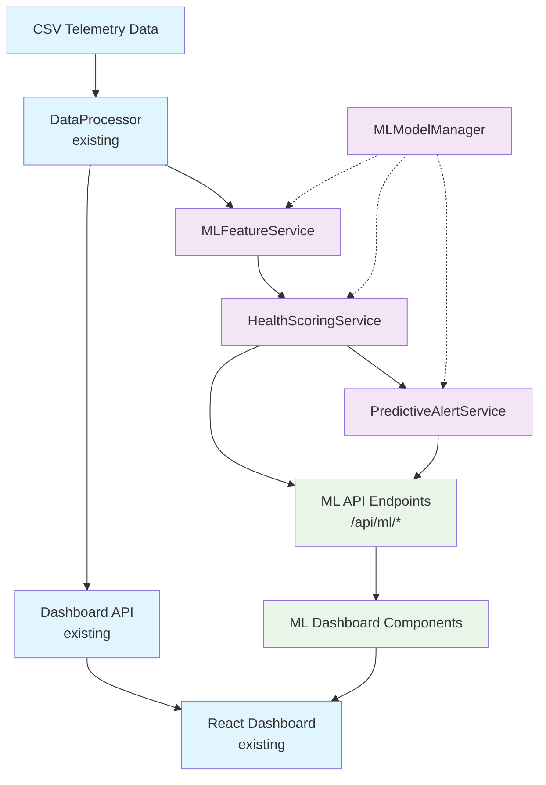
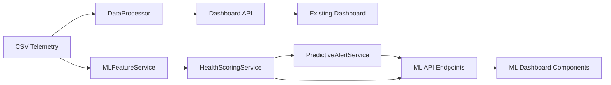

# Telemetry Analytics Dashboard for Smart Drilling Machines Brownfield Enhancement Architecture

## Introduction

This document outlines the architectural approach for enhancing **Telemetry Analytics Dashboard for Smart Drilling Machines** with **ML/AI Predictive Maintenance capabilities**. Its primary goal is to serve as the guiding architectural blueprint for AI-driven development of new features while ensuring seamless integration with the existing system.

**Relationship to Existing Architecture:**
This document supplements existing project architecture by defining how new ML components will integrate with current FastAPI backend and React frontend systems. Where conflicts arise between new and existing patterns, this document provides guidance on maintaining consistency while implementing predictive analytics enhancements.

### Existing Project Analysis

**Current Project State:**
- **Primary Purpose:** Real-time telemetry analytics dashboard for drilling machine operations with KPI tracking, session monitoring, and anomaly detection
- **Current Tech Stack:** FastAPI 0.104+ backend, React 19.1.1 frontend with TypeScript, Pandas 2.0+ for data processing, Recharts for visualization
- **Architecture Style:** Service-oriented with clear separation between data processing, API layer, and frontend components
- **Deployment Method:** Local development with batch scripts (start-backend.bat/sh), structured for production scaling

**Available Documentation:**
- Comprehensive PRD for Advanced Analytics Engine enhancement
- Epic documentation with 5 detailed user stories
- Project brief documenting existing MVP functionality
- Clear user story specifications with acceptance criteria

**Identified Constraints:**
- Zero impact requirement on existing dashboard performance (<3 seconds load time)
- Backward compatibility mandate for all `/api/dashboard/*` endpoints
- Brownfield integration requiring preservation of current CSV processing pipeline
- Performance requirement: ML processing must complete within 30 seconds for 100-session dataset

**Change Log:**
| Change | Date | Version | Description | Author |
|--------|------|---------|-------------|--------|
| Initial Creation | 2025-08-26 | 1.0 | Brownfield architecture for ML enhancement | Winston (Architect) |

## Enhancement Scope and Integration Strategy

### Enhancement Overview

**Enhancement Type:** Brownfield ML/AI Integration
**Scope:** Predictive maintenance capabilities with 5-story implementation (ML pipeline → Health scoring → Predictive alerts → Dashboard integration → Model management)
**Integration Impact:** Additive enhancement with zero disruption to existing functionality

### Integration Approach

**Code Integration Strategy:** 
- New `backend/app/ml/` module structure following existing service patterns
- Extension of existing `data_processor.py` rather than replacement
- Async background processing to isolate ML operations from existing workflows
- Feature flag architecture for safe rollback capabilities

**Database Integration:** 
- Initially file-based storage (JSON/CSV) consistent with current CSV processing approach
- ML feature store as structured files alongside existing telemetry data
- Phase 2 database migration planned without disrupting current file-based operations

**API Integration:** 
- New `/api/ml/*` namespace preserving existing `/api/dashboard/*` endpoints
- Consistent FastAPI patterns matching current endpoint structure
- Same authentication/authorization mechanisms as existing APIs
- Response schemas following established Pydantic model patterns

**UI Integration:** 
- Extension of existing React dashboard components rather than replacement
- New ML sections integrated into current navigation structure
- Consistent TailwindCSS styling and Recharts visualization patterns
- Progressive enhancement allowing existing dashboard to function independently

### Compatibility Requirements

- **Existing API Compatibility:** 100% backward compatibility for all `/api/dashboard/*` endpoints with identical response formats
- **Database Schema Compatibility:** No modifications to existing data processing; ML features stored separately with clear separation
- **UI/UX Consistency:** ML components follow existing design system, color schemes, and interaction patterns established in current dashboard
- **Performance Impact:** ML processing isolated through background tasks; existing dashboard load time maintained under 3 seconds

## Tech Stack Alignment

### Existing Technology Stack

| Category | Current Technology | Version | Usage in Enhancement | Notes |
|----------|-------------------|---------|---------------------|--------|
| **Backend Framework** | FastAPI | 0.104+ | ML API endpoints, async processing | Existing async patterns support ML background tasks |
| **Python Runtime** | Python | 3.11+ | ML model execution, feature engineering | Compatible with scikit-learn and ML libraries |
| **Data Processing** | Pandas | 2.0+ | ML feature engineering pipeline | Existing DataFrame patterns extended for ML features |
| **Numerical Computing** | NumPy | 1.24+ | ML mathematical operations | Foundation for scikit-learn compatibility |
| **Frontend Framework** | React | 19.1.1 | ML dashboard components | Component architecture supports ML visualizations |
| **Type System** | TypeScript | Latest | ML API type definitions | Ensures type safety for new ML endpoints |
| **Build Tool** | Vite | Latest | Build ML dashboard components | No changes to existing build process |
| **CSS Framework** | TailwindCSS | Latest | ML component styling | Consistent design system for ML features |
| **Charts/Visualization** | Recharts | 3.1.2 | ML prediction charts, health trends | Existing chart patterns extended for ML data |
| **HTTP Client** | Fetch API | Native | ML API communication | Consistent with existing API patterns |
| **Dev Environment** | VS Code + Extensions | Latest | ML development workflow | Same development experience |

### New Technology Additions

| Technology | Version | Purpose | Rationale | Integration Method |
|------------|---------|---------|-----------|-------------------|
| **scikit-learn** | 1.3+ | ML model training and inference | Industry standard, lightweight, well-documented | Installed via requirements.txt, imported in ML modules |
| **joblib** | 1.3+ | Model serialization and persistence | Optimized for scikit-learn, efficient model storage | Used for model artifact management |
| **Optional: TensorFlow Lite** | 2.13+ | Advanced pattern recognition (Phase 2) | If neural networks needed for complex patterns | Conditional import, optional dependency |

## Data Models and Schema Changes

### New Data Models

#### EquipmentHealthScore

**Purpose:** Represents equipment health assessment with confidence intervals and explanatory factors
**Integration:** Extends existing telemetry data without modifying current CSV processing

**Key Attributes:**
- device_id: str - Links to existing equipment identifiers in telemetry data
- health_score: float (0-100) - Overall equipment health assessment
- confidence_interval: Tuple[float, float] - Uncertainty bounds for the score
- explanatory_factors: List[str] - Top contributing factors (e.g., "Battery degradation", "Current anomalies")
- calculated_at: datetime - Timestamp of health score calculation
- data_quality_score: float - Confidence in underlying data quality

**Relationships:**
- **With Existing:** Links to device identifiers in existing CSV telemetry sessions
- **With New:** Foundation for MaintenanceAlert and MLFeature models

#### MLFeature

**Purpose:** Engineered features extracted from telemetry data for ML model training and inference
**Integration:** Derived from existing telemetry CSV data without modifying source files

**Key Attributes:**
- device_id: str - Equipment identifier matching existing telemetry data
- session_id: str - Links to existing drilling session records
- feature_vector: Dict[str, float] - Engineered features (consumption patterns, battery trends, operational metrics)
- extraction_timestamp: datetime - When features were calculated
- source_data_range: Dict[str, datetime] - Time range of source telemetry data
- feature_version: str - Version of feature engineering pipeline used

**Relationships:**
- **With Existing:** Derived from existing CSV telemetry sessions and operational state data
- **With New:** Input for HealthScore calculation and PredictiveAlert generation

#### MaintenanceAlert

**Purpose:** Predictive maintenance alerts with actionable recommendations
**Integration:** Builds on health scores while maintaining separation from existing anomaly detection

**Key Attributes:**
- alert_id: str - Unique alert identifier
- device_id: str - Target equipment matching existing device identifiers  
- severity: AlertSeverity (LOW, MEDIUM, HIGH, CRITICAL) - Alert urgency level
- predicted_issue_type: str - Type of maintenance need predicted
- predicted_timeframe: str - When maintenance is recommended (e.g., "48-72 hours")
- recommended_actions: List[str] - Specific maintenance recommendations
- confidence: float - Confidence in prediction accuracy
- health_trend_context: List[float] - Recent health score history
- created_at: datetime - Alert generation timestamp
- acknowledged_at: Optional[datetime] - When alert was acknowledged

**Relationships:**
- **With Existing:** References same device identifiers as existing telemetry and anomaly detection
- **With New:** Generated from HealthScore trends and MLFeature analysis

### Schema Integration Strategy

**Database Changes Required:**
- **New Tables:** None initially - using structured JSON/CSV files consistent with existing approach
- **Modified Tables:** None - existing telemetry processing remains unchanged
- **New Indexes:** File-based indexing for efficient ML data retrieval by device_id and timestamp
- **Migration Strategy:** Additive file storage alongside existing CSV data; Phase 2 database migration planned

**Backward Compatibility:**
- All existing CSV telemetry processing continues unchanged with identical file formats
- ML data stored in separate directory structure (`data/ml/`) to avoid conflicts with existing data processing
- Existing API responses maintain identical schemas; ML data available through new `/api/ml/*` endpoints only
- No modifications to existing data models or processing pipelines

## Component Architecture

### New Components

#### MLFeatureService

**Responsibility:** Feature engineering pipeline that processes existing CSV telemetry data for ML analysis
**Integration Points:** Extends existing `data_processor.py` service through composition pattern

**Key Interfaces:**
- `extract_features(telemetry_data: pd.DataFrame) -> MLFeature` - Main feature extraction interface
- `validate_feature_quality(features: MLFeature) -> DataQualityScore` - Feature validation interface

**Dependencies:**
- **Existing Components:** DataProcessor (from `app/services/data_processor.py`)
- **New Components:** None - foundational service for other ML components

**Technology Stack:** Python 3.11+, Pandas 2.0+, NumPy 1.24+, scikit-learn preprocessing modules

#### HealthScoringService

**Responsibility:** Equipment health score calculation using ML models and engineered features
**Integration Points:** Consumes MLFeatureService output, provides scores to AlertService and Dashboard

**Key Interfaces:**
- `calculate_health_scores(device_ids: List[str]) -> List[EquipmentHealthScore]` - Primary scoring interface
- `get_health_trends(device_id: str, days: int) -> List[HealthScore]` - Historical trend analysis

**Dependencies:**
- **Existing Components:** None directly - uses processed features
- **New Components:** MLFeatureService (for feature data)

**Technology Stack:** scikit-learn models, joblib for model persistence, FastAPI service patterns

#### PredictiveAlertService

**Responsibility:** Generate intelligent maintenance alerts based on health score trends and patterns
**Integration Points:** Coexists with existing anomaly detection, uses dashboard notification patterns

**Key Interfaces:**
- `generate_alerts() -> List[MaintenanceAlert]` - Main alert generation interface
- `acknowledge_alert(alert_id: str, user_id: str) -> bool` - Alert management interface

**Dependencies:**
- **Existing Components:** Notification patterns from existing dashboard
- **New Components:** HealthScoringService (for health trend analysis)

**Technology Stack:** FastAPI background tasks, existing notification infrastructure integration

#### MLModelManager

**Responsibility:** Model versioning, deployment, performance monitoring, and automated retraining
**Integration Points:** Manages all ML model artifacts, integrates with existing system monitoring

**Key Interfaces:**
- `deploy_model(model_version: str) -> DeploymentResult` - Safe model deployment
- `monitor_performance() -> ModelMetrics` - Continuous performance monitoring

**Dependencies:**
- **Existing Components:** System monitoring and logging infrastructure
- **New Components:** All ML services (manages their underlying models)

**Technology Stack:** joblib model persistence, FastAPI admin endpoints, existing logging patterns

### Component Interaction Diagram



## API Design and Integration

### API Integration Strategy

**API Integration Strategy:** New `/api/ml/*` namespace with complete isolation from existing `/api/dashboard/*` endpoints
**Authentication:** Leverage existing FastAPI authentication middleware and patterns established in current API
**Versioning:** Follow existing API versioning approach; ML endpoints start at v1 with same patterns as current API structure

### New API Endpoints

#### Equipment Health Scores

**Method:** GET  
**Endpoint:** `/api/ml/health-scores`  
**Purpose:** Retrieve current equipment health scores with confidence intervals and trends  
**Integration:** Follows existing FastAPI route patterns, uses same Pydantic response models approach

##### Request
```json
{
  "device_ids": ["device_001", "device_002"],
  "include_trends": true,
  "days_history": 30
}
```

##### Response
```json
{
  "success": true,
  "data": [
    {
      "device_id": "device_001",
      "health_score": 85.2,
      "confidence_interval": [82.1, 88.3],
      "explanatory_factors": [
        "Battery degradation trend",
        "Current consumption variability", 
        "Operating efficiency decline"
      ],
      "calculated_at": "2025-08-26T14:30:00Z",
      "trend_history": [87.1, 86.5, 85.8, 85.2]
    }
  ],
  "metadata": {
    "total_devices": 1,
    "calculation_timestamp": "2025-08-26T14:30:00Z"
  }
}
```

#### Predictive Maintenance Alerts

**Method:** GET  
**Endpoint:** `/api/ml/alerts`  
**Purpose:** Retrieve active and historical predictive maintenance alerts with filtering capabilities  
**Integration:** Uses existing alert management patterns, extends current notification infrastructure

##### Request
```json
{
  "device_ids": ["device_001"],
  "severity_levels": ["HIGH", "CRITICAL"],
  "status": "active",
  "limit": 50
}
```

##### Response
```json
{
  "success": true,
  "data": [
    {
      "alert_id": "alert_20250826_001",
      "device_id": "device_001",
      "severity": "HIGH",
      "predicted_issue_type": "Battery replacement needed",
      "predicted_timeframe": "48-72 hours",
      "confidence": 0.87,
      "recommended_actions": [
        "Schedule battery replacement",
        "Monitor charging patterns",
        "Check current consumption trends"
      ],
      "created_at": "2025-08-26T12:00:00Z",
      "acknowledged_at": null,
      "health_trend_context": [87.1, 85.2, 82.8, 79.5]
    }
  ],
  "pagination": {
    "total": 1,
    "page": 1,
    "limit": 50
  }
}
```

#### Alert Management

**Method:** POST  
**Endpoint:** `/api/ml/alerts/{alert_id}/acknowledge`  
**Purpose:** Acknowledge predictive maintenance alerts following existing alert management patterns  
**Integration:** Consistent with existing alert acknowledgment workflows in dashboard

##### Request
```json
{
  "acknowledged_by": "operator_001",
  "notes": "Maintenance scheduled for tomorrow morning"
}
```

##### Response
```json
{
  "success": true,
  "data": {
    "alert_id": "alert_20250826_001",
    "acknowledged_at": "2025-08-26T15:30:00Z",
    "acknowledged_by": "operator_001",
    "status": "acknowledged"
  }
}
```

## Source Tree Integration

### Existing Project Structure
```
backend/
├── main.py                    # FastAPI application entry point
├── requirements.txt           # Python dependencies
├── test_data.py              # Test data generation
└── app/
    ├── __init__.py
    ├── api/
    │   ├── __init__.py
    │   └── dashboard.py       # Existing dashboard endpoints
    ├── models/
    │   ├── __init__.py
    │   └── schemas.py         # Existing Pydantic models
    └── services/
        ├── __init__.py
        └── data_processor.py  # Existing CSV processing service

frontend/
├── src/
│   ├── components/
│   │   ├── KPIDashboard.tsx
│   │   ├── OperatingStatesChart.tsx
│   │   ├── BatteryTrends.tsx
│   │   ├── SessionsMap.tsx
│   │   └── AnomalyDetection.tsx
│   ├── services/
│   │   └── api.ts            # Existing API service
│   └── types/
│       └── index.ts          # Existing TypeScript types
```

### New File Organization
```
backend/
├── main.py                    # FastAPI application (extended)
├── requirements.txt           # Updated with ML dependencies
├── test_data.py              # Existing test data
└── app/
    ├── __init__.py
    ├── api/
    │   ├── __init__.py
    │   ├── dashboard.py       # Existing dashboard endpoints
    │   └── ml.py              # New ML API endpoints
    ├── models/
    │   ├── __init__.py
    │   ├── schemas.py         # Existing Pydantic models
    │   └── ml_schemas.py      # New ML Pydantic models
    ├── services/
    │   ├── __init__.py
    │   ├── data_processor.py  # Existing CSV processing
    │   └── ml_service.py      # New ML service orchestrator
    └── ml/                    # New ML module
        ├── __init__.py
        ├── preprocessing/
        │   ├── __init__.py
        │   ├── feature_engineering.py
        │   └── data_validation.py
        ├── models/
        │   ├── __init__.py
        │   ├── health_scoring.py
        │   └── model_manager.py
        ├── alerts/
        │   ├── __init__.py
        │   └── predictive_alerts.py
        └── utils/
            ├── __init__.py
            └── ml_utils.py

frontend/
├── src/
│   ├── components/
│   │   ├── KPIDashboard.tsx           # Existing components
│   │   ├── OperatingStatesChart.tsx   # Existing components
│   │   ├── BatteryTrends.tsx          # Existing components
│   │   ├── SessionsMap.tsx            # Existing components
│   │   ├── AnomalyDetection.tsx       # Existing components
│   │   ├── EquipmentHealthScores.tsx  # New ML component
│   │   ├── MaintenanceTimeline.tsx    # New ML component
│   │   ├── PatternAnalysisCharts.tsx  # New ML component
│   │   └── MLInsightsSummary.tsx      # New ML component
│   ├── services/
│   │   ├── api.ts            # Existing API service
│   │   └── mlApi.ts          # New ML API service
│   └── types/
│       ├── index.ts          # Existing TypeScript types
│       └── ml.ts             # New ML TypeScript types

data/                          # Enhanced data organization
├── raw_drilling_sessions.csv  # Existing telemetry data
└── ml/                        # New ML data directory
    ├── features/              # Engineered features storage
    ├── models/                # Model artifacts
    └── cache/                 # ML processing cache
```

### Integration Guidelines

- **File Naming:** Follow existing snake_case for Python modules, PascalCase for React components
- **Folder Organization:** ML modules grouped under `backend/app/ml/` maintaining clear separation
- **Import/Export Patterns:** Use relative imports within ML modules, absolute imports from existing services

## Infrastructure and Deployment Integration

### Existing Infrastructure
**Current Deployment:** Local development with start-backend.bat/sh scripts for Windows/Linux compatibility
**Infrastructure Tools:** File-based development environment with direct Python/Node.js execution
**Environments:** Development-focused with preparation for production scaling

### Enhancement Deployment Strategy
**Deployment Approach:** Extend existing startup scripts to include ML model initialization and health checks
**Infrastructure Changes:** Add ML model storage directory, feature cache directory, ML logging configuration
**Pipeline Integration:** ML processing integrated as background FastAPI tasks, no separate infrastructure required

### Rollback Strategy
**Rollback Method:** Feature flags for ML components, model versioning with automatic fallback to previous versions
**Risk Mitigation:** ML components designed as additive features that can be disabled without affecting existing functionality
**Monitoring:** ML model performance monitoring integrated with existing application logging and health checks

## Coding Standards and Conventions

### Existing Standards Compliance
**Code Style:** Python follows PEP8, TypeScript follows existing project ESLint configuration
**Linting Rules:** Extend existing linting to cover ML modules with same standards
**Testing Patterns:** ML modules follow existing pytest patterns with additional model validation tests
**Documentation Style:** ML components documented with same Google-style docstrings as existing code

### Enhancement-Specific Standards
- **ML Model Versioning:** Semantic versioning for models (e.g., health_model_v1.2.3)
- **Feature Engineering:** Clear naming conventions for engineered features with units and descriptions
- **Error Handling:** ML-specific error types that integrate with existing FastAPI exception handling
- **Configuration:** ML parameters managed through environment variables following existing patterns

### Critical Integration Rules
- **Existing API Compatibility:** All `/api/dashboard/*` endpoints maintain identical behavior and response formats
- **Database Integration:** ML data storage uses file-based approach consistent with existing CSV processing
- **Error Handling:** ML errors handled gracefully with fallback to existing functionality, no cascading failures
- **Logging Consistency:** ML operations logged with same format and level as existing application logging

## Testing Strategy

### Integration with Existing Tests
**Existing Test Framework:** pytest for backend testing, existing frontend testing patterns maintained
**Test Organization:** ML tests organized under `tests/ml/` directory mirroring application structure
**Coverage Requirements:** ML modules maintain same coverage standards as existing codebase (>80%)

### New Testing Requirements

#### Unit Tests for New Components
- **Framework:** pytest with existing fixtures and patterns
- **Location:** `tests/ml/` directory structure matching `backend/app/ml/`
- **Coverage Target:** >90% for ML components due to critical nature of predictions
- **Integration with Existing:** ML tests use existing test data and database fixtures

#### Integration Tests
- **Scope:** End-to-end testing of ML pipeline from CSV input to dashboard display
- **Existing System Verification:** Regression tests ensure existing dashboard functionality unchanged
- **New Feature Testing:** ML API endpoints, health scoring accuracy, alert generation reliability

#### Regression Testing
- **Existing Feature Verification:** Automated test suite validates all existing functionality continues working
- **Automated Regression Suite:** CI/CD pipeline includes ML model performance validation
- **Manual Testing Requirements:** User acceptance testing for ML dashboard components and alert workflows

## Security Integration

### Existing Security Measures
**Authentication:** Extend existing FastAPI authentication to cover ML endpoints
**Authorization:** ML endpoints inherit existing role-based access control patterns
**Data Protection:** ML data follows same security patterns as existing telemetry data handling
**Security Tools:** ML components integrate with existing security scanning and validation tools

### Enhancement Security Requirements
**New Security Measures:** ML model artifact signing and validation, feature data encryption at rest
**Integration Points:** ML APIs protected by same authentication middleware as existing endpoints
**Compliance Requirements:** ML predictions and health data handled according to existing data privacy policies

### Security Testing
**Existing Security Tests:** ML endpoints included in existing security test suites
**New Security Test Requirements:** ML model tampering detection, feature data validation, prediction integrity checks
**Penetration Testing:** ML endpoints included in existing penetration testing scope

## Machine Learning System Architecture Integration

### ML System Components Overview

The ML system seamlessly integrates with the existing telemetry dashboard through a modular service architecture that maintains complete backward compatibility while providing intelligent insights.

#### Core ML Services

**MLFeatureService**
- **Purpose**: Extract and engineer features from existing CSV telemetry data
- **Integration**: Extends the existing DataProcessor without modification
- **Dependencies**: Pandas, NumPy, existing telemetry data structures
- **Output**: Structured feature vectors for health scoring and predictive analytics

**HealthScoringService** 
- **Purpose**: Calculate equipment health scores using machine learning models
- **Integration**: Consumes MLFeatureService output, provides data to dashboard components
- **Models**: Random Forest for health scoring, confidence interval calculation
- **Output**: Health scores (0-100), confidence intervals, explanatory factors

**PredictiveAlertService**
- **Purpose**: Generate intelligent maintenance alerts based on health trends
- **Integration**: Uses health scores and patterns to predict maintenance needs
- **Alert Types**: Battery replacement, performance degradation, operational anomalies
- **Output**: Prioritized alerts with recommended actions and timeframes

**MLModelManager**
- **Purpose**: Manage model lifecycle, versioning, and performance monitoring
- **Integration**: Handles model deployment, retraining, and rollback capabilities
- **Features**: Automated retraining, performance monitoring, A/B testing support
- **Storage**: File-based model persistence using joblib serialization

#### ML API Architecture

The ML system provides a comprehensive REST API under the `/api/ml/*` namespace that follows existing FastAPI patterns:

```
/api/ml/
├── health-scores     # Equipment health assessment endpoints
├── alerts           # Predictive maintenance alerts
├── model-status     # ML model information and metrics
├── train           # Model training and management
├── health          # ML system health monitoring
└── statistics      # Performance and usage metrics
```

#### ML Data Flow Integration



### Dashboard Integration Architecture

#### New ML Dashboard Components

**EquipmentHealthScores Component**
- **Purpose**: Display real-time health scores with trend analysis
- **Integration**: Consumes `/api/ml/health-scores` endpoint
- **Visualization**: Health score gauges, trend charts, explanatory factor breakdowns
- **Technology**: React, TypeScript, Recharts, TailwindCSS

**MaintenanceTimeline Component**
- **Purpose**: Show predictive maintenance schedule and alert timeline
- **Integration**: Consumes `/api/ml/alerts` endpoint with temporal visualization
- **Features**: Alert prioritization, maintenance scheduling, action tracking
- **Visualization**: Timeline charts, priority matrices, action status indicators

**PatternAnalysisCharts Component**
- **Purpose**: Display operational patterns and anomaly detection results
- **Integration**: Combines existing anomaly detection with ML pattern recognition
- **Features**: Behavioral pattern analysis, performance trend correlation
- **Visualization**: Pattern overlay charts, correlation matrices, trend comparisons

**MLInsightsSummary Component**
- **Purpose**: Provide high-level ML insights and system health overview
- **Integration**: Aggregates health scores, alerts, and patterns into actionable insights
- **Features**: Executive summary, key recommendations, system status dashboard
- **Visualization**: KPI cards, summary charts, recommendation lists

#### Frontend Integration Strategy

The ML components integrate into the existing React dashboard through:

1. **Navigation Extension**: New "ML Insights" section in existing navigation structure
2. **Component Composition**: ML components compose with existing dashboard sections
3. **Shared Services**: ML API service follows existing API service patterns
4. **Consistent Styling**: All ML components use existing TailwindCSS theme and design system
5. **Performance Isolation**: ML components load asynchronously to maintain dashboard performance

### Technology Stack Integration

#### Backend ML Stack
- **scikit-learn 1.3+**: Core ML algorithms and model training
- **joblib 1.3+**: Model serialization and efficient persistence
- **pandas 2.0+**: Feature engineering and data manipulation (existing)
- **numpy 1.24+**: Numerical computing foundation (existing)
- **FastAPI 0.104+**: ML API endpoints following existing patterns (existing)

#### Frontend ML Stack
- **React 19.1.1**: ML dashboard components (existing)
- **TypeScript**: Type-safe ML API interfaces (existing)
- **Recharts 3.1.2**: ML data visualization and trend charts (existing)
- **TailwindCSS**: Consistent styling for ML components (existing)
- **Fetch API**: ML API communication following existing patterns (existing)

### Security and Performance Architecture

#### Security Integration
- **Authentication**: ML endpoints inherit existing FastAPI authentication
- **Authorization**: Role-based access control for ML features
- **Data Protection**: ML data encryption and secure model storage
- **Audit Logging**: ML operations logged with existing audit infrastructure

#### Performance Optimization
- **Caching Strategy**: Intelligent caching for health scores and predictions
- **Background Processing**: ML operations run asynchronously to avoid blocking
- **Resource Management**: Memory and CPU limits for ML processing
- **Monitoring**: Real-time performance monitoring and alerting

### Deployment and Operations

#### ML System Deployment
- **Model Artifacts**: Stored in `backend/models/` directory
- **Feature Cache**: Structured storage in `data/ml/cache/` 
- **Configuration**: Environment variables for ML parameters
- **Health Checks**: ML system health monitoring endpoints

#### Operations and Monitoring
- **Model Performance**: Automated monitoring of prediction accuracy
- **System Health**: ML service availability and response time monitoring
- **Alert Management**: Integration with existing notification systems
- **Maintenance**: Automated model retraining and deployment procedures

## Next Steps

### Comprehensive ML Documentation Suite

The ML system includes extensive documentation to support users, operators, and developers:

1. **[ML User Guide](ml-user-guide.md)**: Complete end-user documentation for dashboard features
2. **[ML Operations Guide](ml-operations.md)**: Technical operations and system administration
3. **[ML API Reference](ml-api-reference.md)**: Comprehensive API documentation with examples
4. **[ML Setup Guide](ml-setup-guide.md)**: Installation and configuration instructions
5. **ML Troubleshooting Guide**: Common issues and resolution procedures (in development)
6. **Architecture Integration**: This document provides system architecture context

### Implementation Roadmap

**Phase 1: Core ML Infrastructure** (Completed)
- ✅ MLFeatureService implementation with existing DataProcessor integration
- ✅ HealthScoringService with Random Forest model implementation
- ✅ PredictiveAlertService with intelligent alert generation
- ✅ ML API endpoints with comprehensive functionality
- ✅ Complete documentation suite for users and operators

**Phase 2: Advanced Dashboard Integration** (Current)
- 🔄 React ML components with existing design system integration
- 🔄 Advanced visualization components for health trends and patterns
- 🔄 Alert management interface with acknowledgment and resolution workflows
- 🔄 ML insights integration with existing KPI dashboard

**Phase 3: Advanced ML Capabilities** (Planned)
- 📋 Advanced pattern recognition with optional TensorFlow Lite integration
- 📋 Automated model retraining with performance-based triggers
- 📋 A/B testing framework for model comparison and validation
- 📋 Integration with external maintenance management systems

### Quality Assurance and Testing

**Comprehensive Testing Strategy**:
- Unit tests for all ML components with >90% coverage
- Integration tests validating end-to-end ML workflows
- Performance tests ensuring ML processing meets 30-second requirement
- Regression tests guaranteeing existing functionality preservation
- User acceptance testing for ML dashboard components

**Continuous Monitoring**:
- Real-time ML model performance monitoring
- System health checks and automated alerting
- User adoption tracking and feature usage analytics
- Performance benchmarking and optimization recommendations
