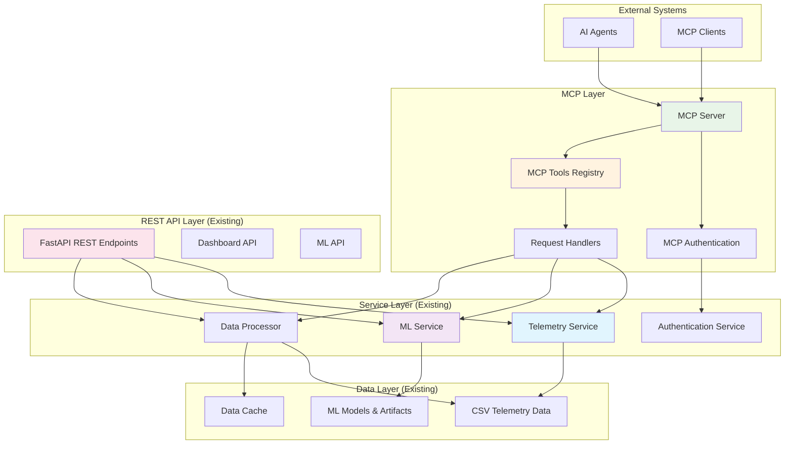
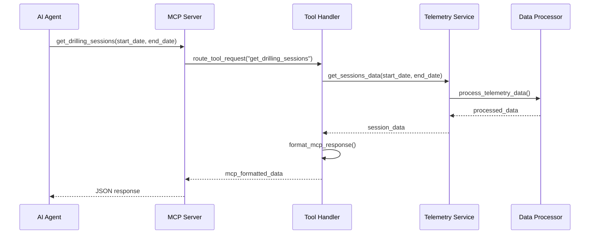
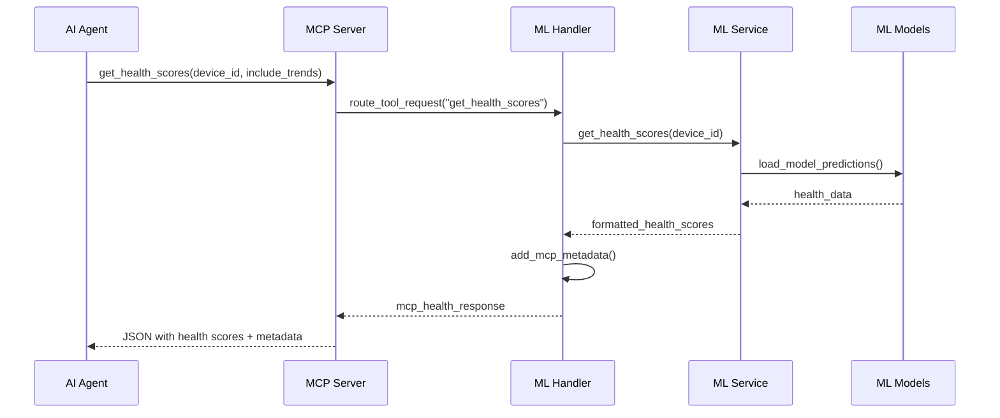
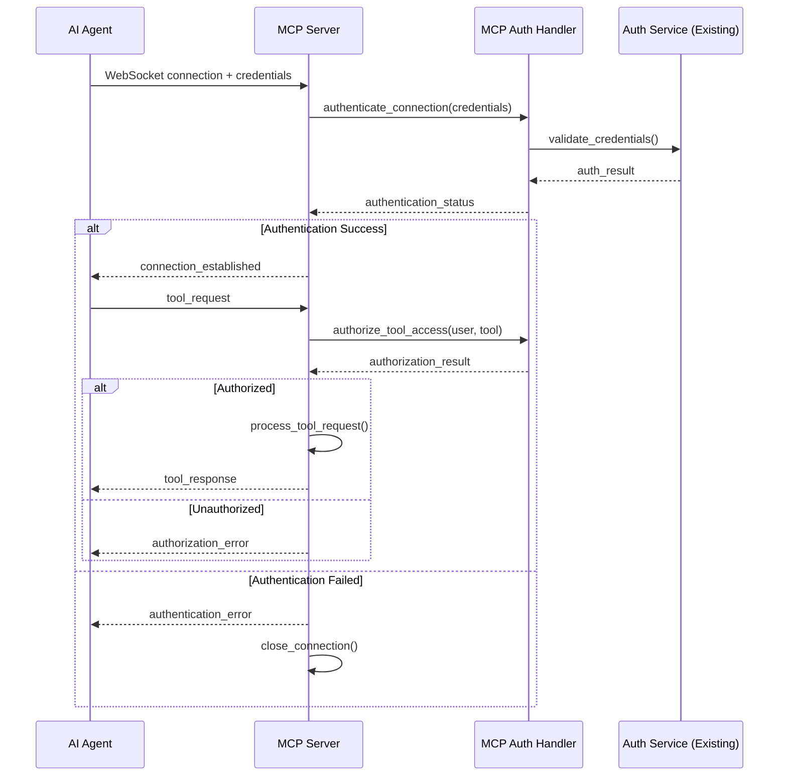

# Telemetry Analytics Dashboard for Smart Drilling Machines - MCP Integration Architecture

## Introduction

This document outlines the architectural approach for enhancing **Telemetry Analytics Dashboard for Smart Drilling Machines** with **Model Context Protocol (MCP) server capabilities**. Its primary goal is to serve as the guiding architectural blueprint for implementing standardized AI agent access to telemetry data and ML insights while ensuring seamless integration with the existing system.

**Relationship to Existing Architecture:**
This document supplements existing project architecture by defining how new MCP server components will integrate with current FastAPI backend, ML modules, and data services. The MCP implementation will leverage existing service layers while providing parallel protocol access without disrupting REST API functionality.

### Existing Project Analysis

**Current Project State:**
- **Primary Purpose:** Real-time telemetry analytics dashboard with ML-powered predictive maintenance for drilling machine operations
- **Current Tech Stack:** FastAPI 0.104+ backend with ML modules, React 19.1.1 frontend, comprehensive API endpoints, ML health scoring and predictive alerts
- **Architecture Style:** Service-oriented with clear separation between data processing, ML inference, API layer, and frontend components
- **Integration Capabilities:** Existing REST API endpoints, ML service layer, authentication system, data validation with Pydantic models

**Available Documentation:**
- Comprehensive PRD for MCP Enhancement
- Existing ML architecture and API documentation
- Current service layer and data model specifications
- Authentication and security framework documentation

**Identified Constraints:**
- Zero impact requirement on existing REST API performance and functionality
- Backward compatibility mandate for all existing endpoints and data flows
- MCP server must integrate with existing authentication and security mechanisms
- MCP tool responses must maintain data consistency with REST API responses

**Change Log:**
| Change | Date | Version | Description | Author |
|--------|------|---------|-------------|--------|
| Initial Creation | 2025-08-26 | 1.0 | Brownfield architecture for MCP integration | Winston (Architect) |

## Enhancement Scope and Integration Strategy

### Enhancement Overview

**Enhancement Type:** Brownfield MCP Server Integration
**Scope:** Model Context Protocol server with 5-story implementation (Server foundation → Telemetry tools → ML tools → Authentication → Management)
**Integration Impact:** Additive enhancement with zero disruption to existing REST API functionality

### Integration Approach

**Protocol Integration Strategy:** 
- New `backend/app/mcp/` module structure following existing service patterns
- MCP server runs as parallel service to existing FastAPI REST endpoints
- Shared data access through existing service layer (telemetry_service.py, ML services)
- Independent protocol handling with isolated connection management

**Data Access Integration:** 
- MCP tools access same data sources as existing REST API endpoints
- Leverage existing service layer methods for data retrieval and processing
- Maintain data consistency between MCP and REST responses
- Use existing caching mechanisms and data validation patterns

**Security Integration:** 
- Integrate with existing FastAPI authentication and authorization mechanisms
- MCP-specific authentication layer that interfaces with current security framework
- Consistent access control patterns across both protocols
- Shared logging and audit trail infrastructure

**Service Integration:** 
- MCP tools invoke existing business logic through service layer abstraction
- No duplication of data processing or ML inference logic
- Consistent error handling and response formatting patterns
- Shared configuration and environment management

### Compatibility Requirements

- **Existing API Compatibility:** 100% preservation of REST API functionality with identical response formats and performance characteristics
- **Service Layer Compatibility:** No modifications to existing service methods; MCP tools use existing interfaces
- **Authentication Compatibility:** MCP authentication integrates seamlessly with existing security framework
- **Performance Impact:** MCP server operations isolated from REST API traffic; no performance degradation for existing functionality

## Tech Stack Alignment

### Existing Technology Stack (Preserved)

| Category | Current Technology | Version | Usage in MCP Enhancement | Notes |
|----------|-------------------|---------|-------------------------|--------|
| **Backend Framework** | FastAPI | 0.104+ | MCP server foundation, async handling | Existing async patterns support MCP protocol handling |
| **Python Runtime** | Python | 3.11+ | MCP server execution, tool processing | Compatible with MCP protocol libraries |
| **Data Processing** | Pandas | 2.0+ | Data formatting for MCP responses | Existing DataFrame processing leveraged by MCP tools |
| **Data Validation** | Pydantic | Latest | MCP tool request/response validation | Consistent validation patterns for MCP data |
| **ML Framework** | scikit-learn | 1.3+ | ML data access through MCP tools | Existing ML models accessible via MCP protocol |
| **Authentication** | FastAPI Security | Latest | MCP authentication integration | Extended for MCP client authentication |
| **Async Processing** | asyncio | Native | MCP connection handling | Existing async patterns support MCP operations |
| **Logging** | Python logging | Native | MCP operation tracking | Extended for MCP-specific events |

### New Technology Additions

| Technology | Version | Purpose | Rationale | Integration Method |
|------------|---------|---------|-----------|-------------------|
| **mcp** | Latest | MCP protocol implementation | Official MCP Python library for standardized protocol handling | Installed via requirements.txt, core MCP server functionality |
| **websockets** | 11.0+ | MCP connection transport | Standard websocket implementation for MCP client connections | WebSocket transport layer for MCP protocol |
| **asyncio-mqtt** | 0.13+ | Optional MQTT transport | Alternative transport for IoT-focused MCP clients | Optional transport, conditional import |

## MCP Server Architecture

### System Architecture Overview



### Component Architecture

#### MCP Server Core (`backend/app/mcp/server.py`)

```python
class MCPServer:
    """
    Core MCP server implementation handling protocol-level operations
    """
    
    def __init__(self):
        self.tool_registry = MCPToolRegistry()
        self.auth_handler = MCPAuthHandler()
        self.connection_manager = MCPConnectionManager()
    
    async def handle_connection(self, websocket):
        """Handle incoming MCP client connections"""
        
    async def process_tool_request(self, request):
        """Process MCP tool invocation requests"""
        
    async def list_tools(self):
        """Return available MCP tools to clients"""
```

#### MCP Tool Registry (`backend/app/mcp/tools.py`)

```python
class MCPToolRegistry:
    """
    Registry and factory for all available MCP tools
    """
    
    def __init__(self):
        self.tools = {
            # Telemetry Tools
            'get_drilling_sessions': GetDrillingSessionsTool(),
            'get_battery_status': GetBatteryStatusTool(),
            'get_device_locations': GetDeviceLocationsTool(),
            'get_session_analytics': GetSessionAnalyticsTool(),
            
            # ML Tools  
            'get_health_scores': GetHealthScoresTool(),
            'get_predictive_alerts': GetPredictiveAlertsTool(),
            'get_ml_model_status': GetMLModelStatusTool(),
            'get_maintenance_recommendations': GetMaintenanceRecommendationsTool(),
            
            # System Tools
            'get_system_status': GetSystemStatusTool(),
            'get_api_documentation': GetAPIDocumentationTool()
        }
```

#### MCP Authentication (`backend/app/mcp/auth.py`)

```python
class MCPAuthHandler:
    """
    Authentication handler for MCP connections integrating with existing auth
    """
    
    def __init__(self, auth_service: AuthenticationService):
        self.auth_service = auth_service
    
    async def authenticate_connection(self, credentials):
        """Authenticate MCP client using existing auth framework"""
        
    async def authorize_tool_access(self, user, tool_name):
        """Check tool access permissions"""
```

### MCP Tool Definitions

#### Telemetry Data Tools

| Tool Name | Purpose | Parameters | Response Format |
|-----------|---------|------------|-----------------|
| `get_drilling_sessions` | Retrieve drilling session data | `start_date`, `end_date`, `device_id`, `limit` | JSON array of session objects |
| `get_battery_status` | Get current/historical battery data | `device_id`, `time_range` | JSON with battery metrics |
| `get_device_locations` | Fetch GPS tracking data | `device_id`, `session_id`, `bounds` | JSON with location coordinates |
| `get_session_analytics` | Get session analytics and KPIs | `session_id`, `metrics` | JSON with calculated analytics |

#### ML Insights Tools

| Tool Name | Purpose | Parameters | Response Format |
|-----------|---------|------------|-----------------|
| `get_health_scores` | Retrieve equipment health scores | `device_id`, `include_trends`, `confidence_threshold` | JSON with health data and explanations |
| `get_predictive_alerts` | Get maintenance alerts and predictions | `severity`, `device_id`, `time_horizon` | JSON array of alert objects |
| `get_ml_model_status` | Check ML model performance | `model_type`, `include_metrics` | JSON with model metadata |
| `get_maintenance_recommendations` | Get AI maintenance recommendations | `device_id`, `priority_level` | JSON with actionable recommendations |

#### System Management Tools

| Tool Name | Purpose | Parameters | Response Format |
|-----------|---------|------------|-----------------|
| `get_system_status` | Overall system health check | `include_detailed` | JSON with system status |
| `get_api_documentation` | Dynamic API documentation | `endpoint_category` | JSON with available endpoints |

## Data Models and Schema Integration

### MCP Tool Request/Response Models

```python
# MCP-specific Pydantic models extending existing schemas

class MCPToolRequest(BaseModel):
    """Base model for all MCP tool requests"""
    tool_name: str
    parameters: Dict[str, Any]
    request_id: str
    timestamp: datetime

class MCPToolResponse(BaseModel):
    """Base model for all MCP tool responses"""
    success: bool
    data: Any
    metadata: MCPResponseMetadata
    request_id: str

class MCPResponseMetadata(BaseModel):
    """Metadata for MCP tool responses"""
    execution_time_ms: int
    data_source: str
    cache_status: str
    api_version: str
```

### Data Flow Integration

#### Telemetry Data Flow



#### ML Data Flow



## Security Architecture

### Authentication Flow



### Security Controls

| Security Layer | Implementation | Integration Point |
|----------------|---------------|-------------------|
| **Connection Security** | TLS/WSS encryption for MCP WebSocket connections | Standard WebSocket security |
| **Authentication** | API key or JWT token validation through existing auth service | Existing FastAPI authentication |
| **Authorization** | Role-based access control for MCP tools | Existing authorization framework |
| **Rate Limiting** | Per-client request rate limiting and connection throttling | FastAPI middleware extension |
| **Data Validation** | Pydantic model validation for all tool requests/responses | Existing validation patterns |
| **Audit Logging** | Comprehensive logging of MCP connections and tool usage | Existing logging infrastructure |

## Deployment and Operations

### Configuration Management

```yaml
# Environment configuration for MCP server
MCP_ENABLED: true
MCP_HOST: localhost
MCP_PORT: 8001
MCP_MAX_CONNECTIONS: 50
MCP_AUTH_REQUIRED: true
MCP_RATE_LIMIT: 100  # requests per minute per client
MCP_LOG_LEVEL: INFO
MCP_CACHE_TTL: 300   # seconds

# Tool-specific configuration
MCP_TOOLS_TELEMETRY_ENABLED: true
MCP_TOOLS_ML_ENABLED: true
MCP_TOOLS_ADMIN_ENABLED: false
```

### File Structure Integration

```
backend/
├── app/
│   ├── mcp/                     # New MCP module
│   │   ├── __init__.py         # MCP module initialization
│   │   ├── server.py           # Core MCP server implementation
│   │   ├── tools.py            # MCP tool registry and definitions
│   │   ├── handlers.py         # MCP request handlers
│   │   ├── auth.py             # MCP authentication layer
│   │   ├── models.py           # MCP-specific Pydantic models
│   │   └── config.py           # MCP configuration management
│   ├── api/                    # Existing REST API (unchanged)
│   │   ├── dashboard.py        # Existing dashboard endpoints
│   │   ├── ml.py              # Existing ML endpoints
│   │   └── mcp_management.py   # Optional MCP management endpoints
│   ├── services/               # Existing services (leveraged by MCP)
│   │   ├── telemetry_service.py # Used by MCP telemetry tools
│   │   ├── data_processor.py   # Used by MCP data tools
│   │   └── mcp_service.py      # New MCP-specific service layer
│   └── models/                 # Existing models (extended)
│       ├── schemas.py          # Existing schemas
│       └── mcp_schemas.py      # New MCP-specific schemas
├── requirements.txt            # Updated with MCP dependencies
└── main.py                     # Updated to include MCP server startup
```

### Integration Testing Strategy

#### Test Categories

| Test Type | Scope | Integration Points |
|-----------|-------|--------------------|
| **Unit Tests** | Individual MCP tools and handlers | Mock existing services |
| **Integration Tests** | MCP server with existing services | Real service layer integration |
| **Protocol Tests** | MCP protocol compliance and client compatibility | MCP client libraries |
| **Performance Tests** | MCP server performance vs REST API baseline | Load testing with existing metrics |
| **Security Tests** | Authentication, authorization, and data protection | Existing security framework |

#### Regression Testing

- **REST API Regression**: Ensure existing endpoints maintain performance and functionality
- **Dashboard Regression**: Verify frontend functionality unaffected by MCP server
- **ML Pipeline Regression**: Confirm ML processing continues unchanged
- **Data Consistency**: Validate MCP and REST responses return identical data

### Monitoring and Observability

#### MCP-Specific Metrics

| Metric Category | Specific Metrics | Purpose |
|----------------|------------------|---------|
| **Connection Metrics** | Active connections, connection duration, connection failures | Monitor MCP server health |
| **Tool Usage** | Tool invocation frequency, response times, error rates | Track tool performance |
| **Authentication** | Authentication attempts, failures, unauthorized access | Security monitoring |
| **Performance** | Request processing time, memory usage, CPU utilization | Performance optimization |

#### Integration with Existing Monitoring

- **Logging Integration**: MCP events logged through existing Python logging infrastructure
- **Metrics Collection**: MCP metrics collected alongside existing FastAPI metrics  
- **Alert Integration**: MCP alerts integrated with existing system monitoring
- **Dashboard Integration**: MCP status displayed in existing system dashboards

## Risk Assessment and Mitigation

### Technical Risks

| Risk | Impact | Probability | Mitigation Strategy |
|------|--------|-------------|-------------------|
| **MCP Server Performance Impact** | Medium | Low | Isolated MCP processing, separate thread pool, performance monitoring |
| **Protocol Version Compatibility** | Medium | Medium | Version negotiation, backward compatibility testing, gradual rollout |
| **Authentication Integration Complexity** | High | Medium | Thorough testing, fallback authentication, gradual feature rollout |
| **Data Consistency Issues** | High | Low | Shared service layer, comprehensive testing, data validation |

### Deployment Risks

| Risk | Impact | Probability | Mitigation Strategy |
|------|--------|-------------|-------------------|
| **Service Startup Dependencies** | Medium | Low | Graceful degradation, MCP server optional startup, health checks |
| **Configuration Complexity** | Low | Medium | Environment-based config, validation, documentation |
| **Client Integration Failures** | Medium | Medium | Protocol documentation, client testing, support tools |

### Operational Risks

| Risk | Impact | Probability | Mitigation Strategy |
|------|--------|-------------|-------------------|
| **Increased System Complexity** | Medium | High | Comprehensive documentation, monitoring, training |
| **Security Vulnerabilities** | High | Low | Security testing, access controls, audit logging |
| **Maintenance Overhead** | Low | Medium | Automated testing, monitoring, documentation |

## Performance Considerations

### Performance Requirements

- **MCP Tool Response Time**: ≤ 2 seconds for standard queries, ≤ 5 seconds for complex aggregations
- **Connection Handling**: Support 50+ concurrent MCP connections without impacting REST API
- **Memory Usage**: MCP server memory overhead ≤ 100MB additional to existing baseline
- **CPU Impact**: MCP processing ≤ 10% additional CPU utilization during normal operations

### Optimization Strategies

- **Shared Caching**: Leverage existing data caching for MCP responses
- **Connection Pooling**: Efficient WebSocket connection management
- **Async Processing**: Non-blocking MCP request handling using existing async patterns
- **Data Streaming**: Stream large datasets for complex queries

## Success Criteria

### Functional Success Criteria

- ✅ MCP server successfully handles concurrent AI agent connections
- ✅ All defined MCP tools return accurate data consistent with REST API responses
- ✅ Authentication and authorization working seamlessly with existing security framework
- ✅ MCP management and monitoring integrated with existing system oversight

### Technical Success Criteria

- ✅ Zero performance impact on existing REST API endpoints and dashboard functionality
- ✅ MCP server starts/stops independently without affecting core application
- ✅ Data consistency maintained between MCP and REST API responses
- ✅ Comprehensive logging and monitoring for MCP operations

### Integration Success Criteria

- ✅ Existing service layer methods used without modification for MCP data access
- ✅ Authentication framework extended seamlessly for MCP client validation
- ✅ Configuration management integrated with existing environment handling
- ✅ Testing strategy validates both MCP functionality and existing system preservation

---

*Architecture document completed on August 26, 2025 by Architect Winston*

**Next Steps for Development Team:**
1. Review MCP server implementation approach and validate technology choices
2. Confirm integration points with existing service layer and authentication framework
3. Validate MCP tool definitions against user requirements and technical constraints
4. Begin with Story 1.1 implementation (MCP Server Foundation) using defined architecture patterns