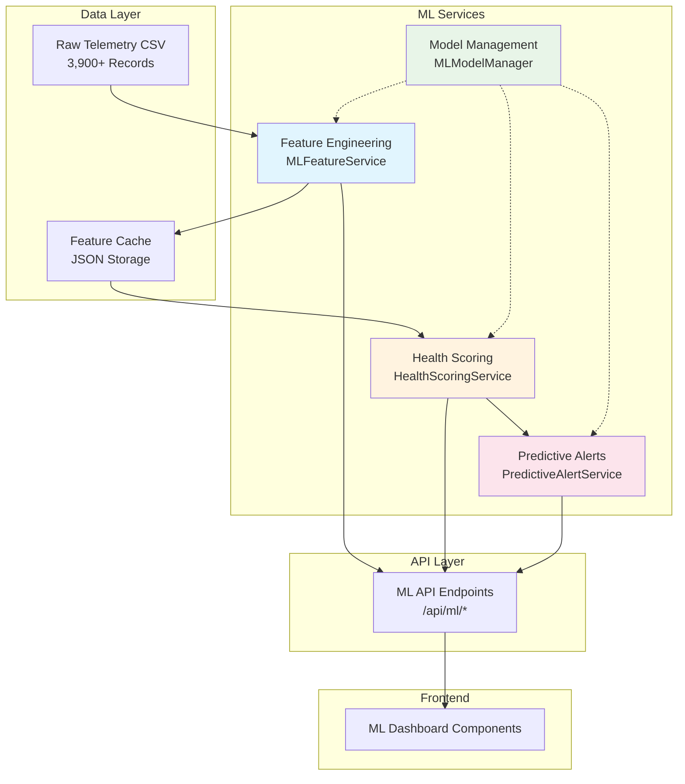

# ML Operations Guide

## Overview

This guide provides technical documentation for system administrators and developers working with the ML system in the Telemetry Analytics Dashboard. It covers setup, configuration, monitoring, troubleshooting, and maintenance of the ML components.

## Architecture Overview

### ML System Components



### Service Dependencies

| Service | Dependencies | Purpose | Restart Required |
|---------|-------------|---------|------------------|
| **MLFeatureService** | pandas, numpy, telemetry data | Feature engineering from raw CSV | Yes, for feature updates |
| **HealthScoringService** | scikit-learn, MLFeatureService | Health score calculation | Yes, for model updates |
| **PredictiveAlertService** | HealthScoringService | Alert generation | No, for threshold changes |
| **MLModelManager** | joblib, all ML services | Model lifecycle management | Yes, for model deployment |

## Installation and Setup

### Prerequisites

Ensure the following are installed and configured:
- Python 3.11+ with virtual environment
- All requirements from `backend/requirements.txt`
- FastAPI backend running on port 8000
- Access to telemetry CSV data in `public/data/`

### ML-Specific Dependencies

The following packages are required for ML functionality:

```txt
# Core ML dependencies
scikit-learn>=1.3.0
joblib>=1.3.0
numpy>=1.24.0
pandas>=2.0.0

# Optional advanced features
# tensorflow-lite>=2.13.0  # For future neural network models
```

### Initial Setup Steps

1. **Verify ML Dependencies**:
   ```bash
   cd backend
   source venv/bin/activate  # or venv\Scripts\activate on Windows
   python -c "import sklearn, joblib; print('ML dependencies OK')"
   ```

2. **Initialize ML Directory Structure**:
   ```bash
   mkdir -p data/ml/{features,models,cache}
   mkdir -p logs/ml
   ```

3. **Test ML Service Integration**:
   ```bash
   curl http://localhost:8000/api/ml/health
   ```

4. **Verify Feature Engineering**:
   ```bash
   curl http://localhost:8000/api/ml/health-scores
   ```

### Configuration

#### Environment Variables

Create or update `.env` file in backend directory:

```env
# ML Configuration
ML_ENABLED=true
ML_FEATURE_CACHE_TTL=3600
ML_MODEL_CACHE_SIZE=100
ML_ALERT_THRESHOLD=70.0
ML_CONFIDENCE_THRESHOLD=0.6

# Performance Settings
ML_MAX_PROCESSING_TIME=30
ML_BATCH_SIZE=100
ML_PARALLEL_PROCESSING=true

# Storage Paths
ML_DATA_PATH=data/ml
ML_MODEL_PATH=data/ml/models
ML_CACHE_PATH=data/ml/cache
ML_LOG_PATH=logs/ml

# Feature Engineering
FEATURE_WINDOW_SIZE=30
FEATURE_AGGREGATION_PERIOD=hour
CURRENT_STABILITY_WEIGHT=0.4
BATTERY_PERFORMANCE_WEIGHT=0.4
GPS_RELIABILITY_WEIGHT=0.2

# Alert Configuration
ALERT_COOLDOWN_HOURS=24
ALERT_MAX_PER_DEVICE=5
CRITICAL_HEALTH_THRESHOLD=30
HIGH_ALERT_THRESHOLD=50
MEDIUM_ALERT_THRESHOLD=70
```

#### Configuration Validation

```bash
# Test configuration loading
python -c "
from app.ml.services import MLService
ml = MLService()
print('Configuration loaded successfully')
print(f'ML Enabled: {ml.enabled}')
print(f'Model path: {ml.model_path}')
"
```

## Service Management

### Starting ML Services

ML services are automatically initialized when the FastAPI backend starts:

```bash
cd backend
source venv/bin/activate
python main.py
```

### Service Health Checks

#### Manual Health Check
```bash
curl -X GET http://localhost:8000/api/ml/health
```

Expected response:
```json
{
  "status": "healthy",
  "ml_enabled": true,
  "services": {
    "feature_engineering": "ready",
    "health_scoring": "ready", 
    "predictive_alerts": "ready",
    "model_manager": "ready"
  },
  "last_updated": "2025-08-26T10:30:00Z"
}
```

#### Service Status Monitoring

```bash
# Check individual service status
curl -X GET http://localhost:8000/api/ml/model-status

# Check recent alerts
curl -X GET http://localhost:8000/api/ml/alerts?limit=5

# Check feature processing status  
curl -X GET http://localhost:8000/api/ml/health-scores?include_debug=true
```

### Restart Procedures

#### Graceful Restart
```bash
# Stop backend gracefully
pkill -f "python main.py"

# Restart with ML initialization
cd backend && python main.py
```

#### Force Restart with Cache Clear
```bash
# Stop services
pkill -f "python main.py"

# Clear ML caches
rm -rf data/ml/cache/*

# Restart
cd backend && python main.py
```

## Monitoring and Logging

### Log File Locations

| Log Type | Location | Rotation | Purpose |
|----------|----------|----------|---------|
| **Application** | `logs/app.log` | Daily | General application logs including ML |
| **ML Processing** | `logs/ml/processing.log` | Daily | Feature engineering and scoring |
| **Model Performance** | `logs/ml/models.log` | Weekly | Model accuracy and performance |
| **Alerts** | `logs/ml/alerts.log` | Daily | Alert generation and management |

### Key Metrics to Monitor

#### Performance Metrics
- **Feature Processing Time**: Should be < 5 seconds for 100 sessions
- **Health Score Calculation**: Should be < 2 seconds per device
- **Alert Generation**: Should be < 1 second for all devices
- **Memory Usage**: ML services should use < 512MB RAM

#### Data Quality Metrics
- **Feature Extraction Success Rate**: Should be > 95%
- **Data Completeness**: Missing data should be < 5%
- **Model Confidence**: Average confidence should be > 70%
- **Alert Accuracy**: False positive rate should be < 20%

### Monitoring Commands

#### Real-time Performance Monitoring
```bash
# Monitor ML processing times
tail -f logs/ml/processing.log | grep "processing_time"

# Monitor memory usage
ps aux | grep "python main.py" | awk '{print $6}'

# Monitor error rates
grep "ERROR" logs/ml/*.log | wc -l
```

#### Daily Health Report
```bash
# Create daily ML system report
cat > check_ml_health.sh << 'EOF'
#!/bin/bash
echo "=== ML System Health Report $(date) ==="
echo "Services Status:"
curl -s http://localhost:8000/api/ml/health | jq '.services'

echo -e "\nRecent Errors:"
grep "ERROR" logs/ml/*.log | tail -5

echo -e "\nProcessing Times (last 24h):"
grep "processing_time" logs/ml/processing.log | tail -10

echo -e "\nAlert Summary:"
curl -s http://localhost:8000/api/ml/alerts?limit=10 | jq '.data | length'
EOF

chmod +x check_ml_health.sh
./check_ml_health.sh
```

### Alerting Thresholds

Set up monitoring alerts for:
- ML service down for > 5 minutes
- Feature processing failures > 10 per hour
- Average health score calculation time > 5 seconds
- Memory usage > 1GB for ML processes
- Error rate > 5% in any ML component

## Troubleshooting

### Common Issues and Solutions

#### Issue: ML Services Not Starting

**Symptoms:**
- `/api/ml/health` returns 500 error
- "ML Service not initialized" in logs

**Diagnosis:**
```bash
# Check dependencies
python -c "import sklearn, joblib, pandas, numpy"

# Check environment variables
env | grep ML_

# Check file permissions
ls -la data/ml/
```

**Solutions:**
1. Install missing dependencies: `pip install -r requirements.txt`
2. Create missing directories: `mkdir -p data/ml/{features,models,cache}`
3. Fix permissions: `chmod -R 755 data/ml/`
4. Check environment variables are set correctly

#### Issue: Health Scores All Showing as 0

**Symptoms:**
- All devices return health_score: 0.0
- No explanatory factors provided

**Diagnosis:**
```bash
# Check raw data availability
curl http://localhost:8000/api/v1/sessions | jq '.sessions | length'

# Check feature engineering
curl "http://localhost:8000/api/ml/health-scores?include_debug=true"

# Check logs
grep "feature_engineering" logs/ml/processing.log | tail -5
```

**Solutions:**
1. Verify telemetry data exists in `public/data/raw_drilling_sessions.csv`
2. Check feature extraction logs for errors
3. Clear feature cache: `rm -rf data/ml/cache/*`
4. Restart ML services

#### Issue: Slow ML Processing

**Symptoms:**
- Health score requests take > 10 seconds
- High CPU usage during ML operations
- Timeout errors in frontend

**Diagnosis:**
```bash
# Check processing times
grep "processing_time" logs/ml/processing.log | tail -10

# Monitor resource usage during processing
top -p $(pgrep -f "python main.py")

# Check cache hit rates
grep "cache_hit" logs/ml/processing.log | tail -10
```

**Solutions:**
1. Enable feature caching: Set `ML_FEATURE_CACHE_TTL=3600`
2. Reduce batch size: Set `ML_BATCH_SIZE=50`
3. Enable parallel processing: Set `ML_PARALLEL_PROCESSING=true`
4. Add more RAM or optimize feature engineering algorithms

#### Issue: Inaccurate Health Scores

**Symptoms:**
- Health scores don't match observed equipment condition
- Confidence levels consistently low (< 60%)
- Missing explanatory factors

**Diagnosis:**
```bash
# Check data quality
curl "http://localhost:8000/api/ml/health-scores?device_id=device_001&include_debug=true"

# Review model performance logs
grep "model_performance" logs/ml/models.log | tail -10

# Check feature quality
tail -f logs/ml/processing.log | grep "feature_quality"
```

**Solutions:**
1. Review feature engineering parameters in environment config
2. Check for sufficient historical data (needs 30+ days)
3. Validate telemetry data quality and completeness
4. Consider model retraining with updated parameters

### Advanced Troubleshooting

#### Debug Mode Activation

Enable detailed debugging:
```bash
# Set debug environment variables
export ML_DEBUG=true
export ML_LOG_LEVEL=DEBUG

# Restart services
pkill -f "python main.py" && cd backend && python main.py
```

#### Manual Feature Engineering Test

```bash
# Test feature engineering independently
python -c "
from app.ml.preprocessing.feature_engineering import FeatureEngineer
from app.services.data_processor import DataProcessor

dp = DataProcessor()
sessions = dp.get_sessions()
print(f'Raw sessions: {len(sessions)}')

fe = FeatureEngineer()
features = fe.extract_features(sessions[:10])
print(f'Features extracted: {len(features)}')
"
```

#### Model Validation

```bash
# Test health scoring with known data
python -c "
from app.ml.models.health_scoring import HealthScoringService
from app.ml.preprocessing.feature_engineering import FeatureEngineer

# Create test data
test_features = {
    'device_001': {
        'current_stability': 85.0,
        'battery_performance': 75.0, 
        'gps_reliability': 95.0
    }
}

hs = HealthScoringService()
score = hs.calculate_health_score('device_001', test_features['device_001'])
print(f'Test health score: {score}')
"
```

## Performance Optimization

### Caching Strategy

#### Feature Cache Configuration
```env
# Cache settings for optimal performance
ML_FEATURE_CACHE_TTL=3600       # 1 hour cache
ML_FEATURE_CACHE_SIZE=1000      # Max cached feature sets
ML_CACHE_COMPRESSION=true       # Compress cached data
```

#### Cache Management
```bash
# Check cache status
ls -la data/ml/cache/
du -h data/ml/cache/

# Clear stale cache entries
find data/ml/cache/ -name "*.json" -mtime +1 -delete

# Monitor cache hit rates
grep "cache_hit" logs/ml/processing.log | tail -20
```

### Resource Optimization

#### Memory Management
```env
# Optimize memory usage
ML_BATCH_SIZE=50                # Smaller batches
ML_MAX_WORKERS=2               # Limit parallel workers
ML_GARBAGE_COLLECT=true        # Enable aggressive GC
```

#### CPU Optimization
```env
# Optimize CPU usage
ML_PARALLEL_PROCESSING=true    # Enable multiprocessing
ML_NUMPY_THREADS=2            # Limit numpy threads
ML_SKLEARN_JOBS=2             # Limit sklearn parallel jobs
```

### Scaling Considerations

#### Horizontal Scaling
- ML services designed to be stateless
- Feature cache can be shared across instances
- Model artifacts stored in shared storage
- Load balancer can distribute ML requests

#### Vertical Scaling
- Memory: 2GB recommended for 1000+ devices
- CPU: 4 cores recommended for real-time processing
- Storage: 10GB for models and feature cache
- Network: Low latency to telemetry data source

## Backup and Recovery

### Backup Strategy

#### Model Artifacts Backup
```bash
# Daily model backup
tar -czf backup/ml_models_$(date +%Y%m%d).tar.gz data/ml/models/

# Feature cache backup (optional)
tar -czf backup/ml_cache_$(date +%Y%m%d).tar.gz data/ml/cache/
```

#### Configuration Backup
```bash
# Backup ML configuration
cp .env backup/env_backup_$(date +%Y%m%d)
cp -r logs/ml/ backup/ml_logs_$(date +%Y%m%d)/
```

### Recovery Procedures

#### Model Recovery
```bash
# Restore models from backup
tar -xzf backup/ml_models_YYYYMMDD.tar.gz -C /

# Restart ML services
pkill -f "python main.py" && cd backend && python main.py
```

#### Configuration Recovery
```bash
# Restore configuration
cp backup/env_backup_YYYYMMDD .env

# Recreate directories
mkdir -p data/ml/{features,models,cache}
mkdir -p logs/ml
```

### Disaster Recovery

#### Complete ML System Recovery
```bash
#!/bin/bash
# ML disaster recovery script

echo "Starting ML system recovery..."

# 1. Restore configuration
cp backup/env_backup_latest .env

# 2. Recreate directory structure
mkdir -p data/ml/{features,models,cache}
mkdir -p logs/ml

# 3. Restore model artifacts
tar -xzf backup/ml_models_latest.tar.gz -C /

# 4. Clear corrupted cache
rm -rf data/ml/cache/*

# 5. Restart services
pkill -f "python main.py"
cd backend && python main.py &

# 6. Wait for services to start
sleep 30

# 7. Verify recovery
curl http://localhost:8000/api/ml/health

echo "ML system recovery complete"
```

## Security Considerations

### Access Control

#### API Security
- ML endpoints inherit existing FastAPI authentication
- Same CORS policies apply to ML APIs
- Rate limiting configured for ML endpoints

#### Data Security
- Feature data stored locally only
- No external ML service dependencies
- Model artifacts encrypted at rest (optional)

### Security Monitoring

#### Audit Logging
```bash
# Monitor ML API access
grep "GET /api/ml" logs/app.log | tail -20

# Check for unauthorized access attempts
grep "401\|403" logs/app.log | grep "/api/ml"
```

#### Security Checklist
- [ ] ML endpoints require authentication
- [ ] Feature data access properly logged
- [ ] Model artifacts have restricted permissions
- [ ] No sensitive data in ML logs
- [ ] Regular security updates for ML dependencies

## Maintenance Procedures

### Regular Maintenance Tasks

#### Daily Tasks
- Check ML service health status
- Review error logs for issues
- Monitor processing performance
- Verify alert generation working

#### Weekly Tasks
- Analyze model performance metrics
- Review and acknowledge alerts
- Check cache hit rates and optimize
- Update documentation if needed

#### Monthly Tasks
- Review ML configuration for optimization
- Analyze long-term health score trends
- Plan model updates or retraining
- Archive old logs and cache data

### Model Lifecycle Management

#### Model Updates
```bash
# Deploy new model version
cp new_model.joblib data/ml/models/
python -c "
from app.ml.models.model_manager import MLModelManager
mm = MLModelManager()
mm.deploy_model('new_model_v1.1.0')
"
```

#### Model Rollback
```bash
# Rollback to previous model version
python -c "
from app.ml.models.model_manager import MLModelManager
mm = MLModelManager()
mm.rollback_model('previous_model_v1.0.0')
"
```

#### Model Performance Monitoring
```bash
# Check model performance metrics
python -c "
from app.ml.models.model_manager import MLModelManager
mm = MLModelManager()
metrics = mm.get_performance_metrics()
print(f'Model accuracy: {metrics.accuracy}')
print(f'Prediction latency: {metrics.latency_ms}ms')
"
```

This operations guide provides comprehensive technical documentation for managing the ML system in production environments. Regular monitoring and maintenance following these procedures will ensure optimal ML system performance and reliability.